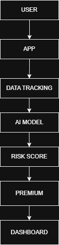

# 🚀 Smart Delivery Worker Insurance & Risk Optimization Platform

## 📌 Problem Statement
Delivery workers face uncertain risks such as accidents, delays, fraud, and income instability. Current insurance systems use fixed pricing models that do not adapt to real-time working conditions, making them unfair and inefficient.

---

## 👤 Persona-Based Scenarios

### 👤 Ravi (Full-time Delivery Partner)
- Works long hours daily
- Covers large distances
- High exposure to risk  

**Problem:** Pays same premium as low-risk workers → unfair pricing  

---

### 👤 Priya (Part-time Delivery Worker)
- Works only weekends  
- Low number of deliveries  

**Problem:** Overpaying for insurance  

---

### 👤 Arjun (New Delivery Partner)
- Less experience  
- Higher chance of mistakes  

**Problem:** Needs adaptive monitoring and pricing  

---

## 🔄 Application Workflow

1. User logs into the system  
2. App tracks:
   - Distance travelled  
   - Number of deliveries  
   - Working hours  
3. AI model processes the data  
4. Risk score is calculated  
5. Weekly premium is generated  
6. Dashboard displays insights and premium  
7. Fraud detection system flags anomalies  

---

## 💰 Weekly Premium Model

### How it works:
Premium is dynamically calculated every week based on:

- Distance covered  
- Delivery frequency  
- Working hours (day/night)  
- Location risk  
- Past behavior  

---

### 📊 Parametric Triggers

| Parameter            | Effect on Premium |
|---------------------|------------------|
| High distance       | Increase         |
| Night shifts        | Increase         |
| Safe driving        | Decrease         |
| High cancellations  | Fraud alert      |

---

### 💡 Why Weekly Model?
- More flexible than monthly plans  
- Adapts to real-time behavior  
- Ensures fair pricing  

---

## 📱 Platform Choice

**Chosen Platform: Web Application**

### Justification:
- Easy access across devices  
- Faster development  
- No installation required  

---

## 🤖 AI/ML Integration

### 1. Premium Calculation
- Predict risk score using machine learning models  

### 2. Fraud Detection
- Detect abnormal patterns like fake deliveries  

### 3. Risk Prediction
- Analyze past behavior for future risk  

---

## 🛠 Tech Stack

- **Frontend:** React.js  
- **Backend:** Spring Boot  
- **Database:** MySQL  
- **AI/ML:** Python (Scikit-learn)  
- **APIs:** Maps API for distance tracking  

---

## 🧩 Development Plan

### Week 1:
- UI design  
- Backend setup  
- Database design  

### Week 2:
- Premium logic implementation  
- AI model integration  
- Dashboard development  

---

## 📊 Workflow Diagram

## 🔗 GitHub Repository
(Your repo link here)

---

## 🎥 Demo Video
(Add your video link here)

---

## 📌 Conclusion
This platform ensures fair, adaptive, and intelligent insurance pricing for delivery workers using real-time data and AI-driven insights.
